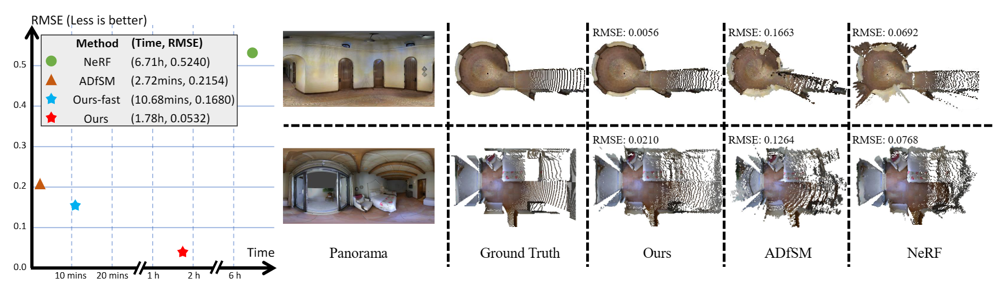

# IndoorPanoDepth
We present a novel neural representation based method for depth estimation from a few panoramic images of different views. 

This is the official repo for the implementation of [Depth Estimation from Indoor Panoramas with Neural Scene Representation (CVPR'2023)](https://openaccess.thecvf.com/content/CVPR2023/html/Chang_Depth_Estimation_From_Indoor_Panoramas_With_Neural_Scene_Representation_CVPR_2023_paper.html).

## Usage
For the Matterport3D and Stanford2D3D datasets, we adopt the rerendered version from [3D60](https://vcl3d.github.io/3D60/). The brightness-adjusted dataset could be generated with 'adjust.py'.
### Matterport3D
Copy the scenes to ./data/Matterport3D
```
SCENES="0_0b217f59904d4bdf85d35da2cab963471 1_0b724f78b3c04feeb3e744945517073d1 0_a2577698031844e7a5982c8ee0fecdeb1 0_9f2deaf4cf954d7aa43ce5dc70e7abbe1 0_7812e14df5e746388ff6cfe8b043950a1 4_0b724f78b3c04feeb3e744945517073d1 2_0b217f59904d4bdf85d35da2cab963471 1_7812e14df5e746388ff6cfe8b043950a1 47_a2577698031844e7a5982c8ee0fecdeb1 45_a2577698031844e7a5982c8ee0fecdeb1"
for scene in $SCENES; do
cp 3D60/Matterport3D/"$scene"_* ./data/Matterport3D
done
```

Direct run the following command.
```
sh Matterport3D.sh
```
---
### Stanford2D3D
Copy the scenes to ./data/Stanford2D3D
```
SCENES="1_area_5a1 1_area_5b1 5_area_5a1 10_area_61 207_area_41"
for scene in $SCENES; do
cp 3D60/Stanford2D3D/"$scene"_* ./data/Stanford2D3D
done
```
Direct run the following command.
```
sh Stanford2D3D.sh
```
---
### Our dataset
First download our dataset from https://1drv.ms/u/s!AmmYGRQ4ky-T1N0Bv8x7Oq_qQiKmNg?e=xUlxHR. Then, unzip it to the './data' fold as follows:
```
|-- code
    |-- data      
        |-- Matterport3D
        |-- Stanford2D3D
        |-- ours 
            |-- bedroom  
            ...
```
Finally, run the command
```
sh ours.sh
```


## Acknowledgement
The main framework is borrowed from [NeuS](https://github.com/Totoro97/NeuS). The 3D models used for rendering dataset are from [Flavio, Della, Tommasa](https://download.blender.org/demo/cycles/flat-archiviz.blend), [Christophe, Seux](https://download.blender.org/demo/test/classroom.zip) and [Tadeusz](https://blenderartists.org/t/free-scene-loft-interior-design/1200857).
Thanks for these great works.
